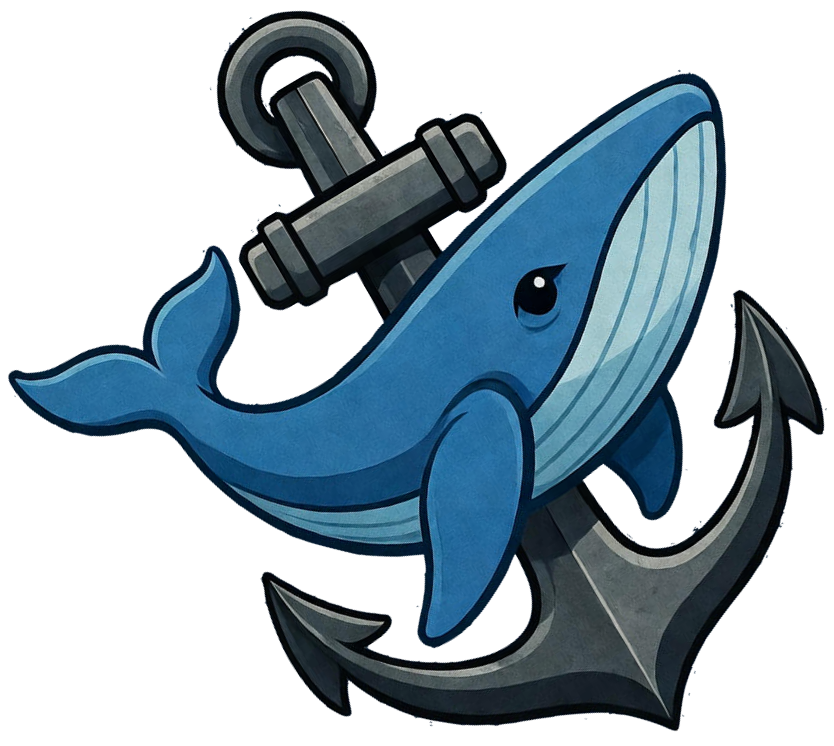

# Docked

A modern web application for managing Docker container updates through Portainer integration. Keep your containers up to date with automatic update detection and one-click upgrades.



## What is Docked?

Docked connects to your Portainer instances to monitor and manage Docker containers. It automatically detects available image updates and provides a clean interface to upgrade containers with a single click!

Beyond Portainer-managed containers, Docked can also track applications directly from their source repositories. You can monitor applications by adding GitHub or GitLab repositories, and Docked will track new releases even if they aren't published to Docker registries. This is perfect for keeping up with applications that release on GitHub or GitLab but may not immediately update their Docker images.

Perfect for home lab enthusiasts and small teams managing multiple Docker environments who want a unified view of all their application updates.

## Features

- 🔐 **Secure Authentication** - User-based authentication with role management
- 🔍 **Automatic Update Detection** - Scans containers and identifies available updates
- 🎨 **Modern UI** - Clean, responsive interface with dark mode support
- 🔄 **One-Click Upgrades** - Upgrade individual containers or batch process multiple updates
- 🔌 **Portainer Integration** - Connect multiple Portainer instances
- 📊 **Tracked Apps** - Monitor applications from Docker registries, GitHub releases, or GitLab releases
- 🐙 **GitHub Integration** - Track GitHub repositories and get notified of new releases
- 🦊 **GitLab Integration** - Track GitLab repositories and monitor release versions
- 🔔 **Notifications** - Stay informed about available updates
- 📦 **Image Management** - View and clean up unused Docker images

## Quick Start

### Docker Compose (Recommended)

Create a `docker-compose.yml` file:

```yaml
services:
  docked:
    image: ghcr.io/dodgerbluee/docked:latest
    container_name: docked
    restart: unless-stopped
    ports:
      - "6969:3000"
    environment:
      - TZ=America/Chicago
      - PORT=3000
    volumes:
      - ./data:/data
```

Start the container:

```bash
docker-compose up -d
```

Access the application at `http://localhost:6969`

### Development Setup

1. Clone the repository:

```bash
git clone https://github.com/dodgerbluee/docked.git
cd docked
```

2. Install dependencies:

```bash
npm run install-all
```

3. Configure backend:

```bash
cd server
cp .env.example .env
# Edit .env with your settings
```

4. Run development server:

```bash
npm run dev
```

Access at `http://localhost:3000` (frontend) and `http://localhost:3001` (backend API)

## Usage

### First Time Setup

1. Create your first user account on the login page
2. Add your Portainer instance(s) in Settings to start monitoring Docker containers
3. Optionally configure Docker Hub credentials for higher API rate limits
4. Add tracked applications (GitHub/GitLab repos or Docker images) to monitor releases
5. Start monitoring and upgrading containers

### Core Workflow

1. **Add Portainer Instances** - Connect your Portainer instances to monitor Docker containers
2. **Monitor Containers** - View all containers with update status from your Portainer instances
3. **Track Applications** - Add GitHub or GitLab repositories to monitor applications directly from their source
   - **GitHub Repos**: Track releases using the format `owner/repo` (e.g., `dodgerbluee/docked`)
   - **GitLab Repos**: Track releases from GitLab projects (optionally use access tokens for private repos)
   - **Docker Images**: Track specific Docker images from any registry
4. **Upgrade** - One-click upgrades for individual containers or batch process multiple updates
5. **Stay Notified** - Get notifications when tracked applications have new releases

## Screenshots

> Add screenshots of your application here showing the main dashboard, container list, and upgrade interface.

## Configuration

### Environment Variables

- `PORT` - Application port (default: 3000)
- `TZ` - Timezone (default: UTC)
- `DATA_DIR` - Data directory path (default: /data)

### Application Settings

Configure through the web UI:

- Portainer instances (URL and API keys)
- Docker Hub credentials (username and personal access token)
- User management and preferences

## Architecture

- **Backend**: Node.js/Express REST API
- **Frontend**: React with modern UI components
- **Database**: SQLite (can be configured for PostgreSQL/MySQL)
- **Integration**: Portainer API for container management

## Contributing

Contributions are welcome! Whether you've found a bug or have a feature suggestion, we'd love to hear from you.

### Reporting Issues

Found a bug or have a recommendation? [Open an issue](https://github.com/dodgerbluee/docked/issues) and let us know!

- Use the [Bug Report](.github/ISSUE_TEMPLATE/bug_report.md) template for defects
- Use the [Feature Request](.github/ISSUE_TEMPLATE/feature_request.md) template for new ideas

### Development

1. Fork the repository
2. Create a feature branch (`git checkout -b feature/amazing-feature`)
3. Make your changes
4. Run tests (`npm test`)
5. Commit using [Conventional Commits](https://www.conventionalcommits.org/)
6. Push and open a Pull Request

## Star History

[](https://star-history.com/#dodgerbluee/docked&Date)

## License

MIT
